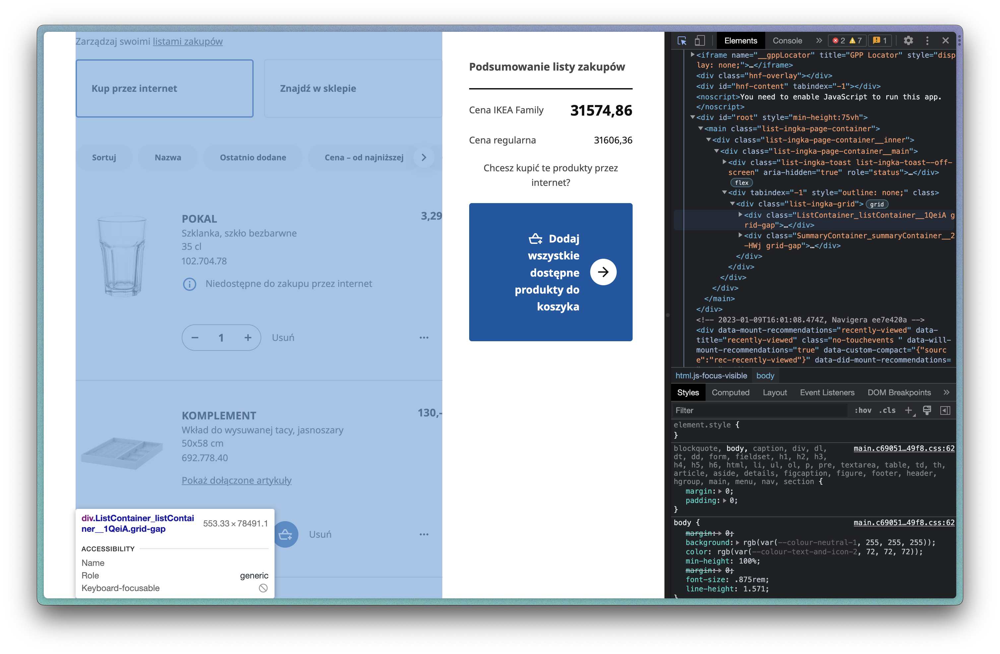

# Parse IKEA

Me and my wife needed to buy a lot of IKEA after we moved to the new apartments. My wife liked 261 items in the mobile app and we needed to decide what to buy. It was to hard for me to open every item, check whether it available for delivery or not, so i decided to parse these links and make a Google Sheet with the list. Also Google Sheet is much more convinient for budgeting :)
First I tried IMPORTXML function, but it did not manage to work 261 times :(

First, I needed to get a list of items to parse. I have just opened the page with liked items and have downloaded source code. 


Then I extracted links to items and links to jpg previews using regexp 

```http[A-Za-z0-9-_\/:\.]+.jpg((?!http).)*https://www.ikea.com/pl/pl/p[A-Za-z0-9:\/.-]+\d```

Second, I need to parse the links. Parsing of names and prices was quiet easy and is implemented with requests. But availability was updated dynamically with JavaScript, so i had to use Selenium. See the script [parse_ikea.py](https://github.com/arkazantsev8/parse_ikea/blob/main/parse_ikea.py) for the details
I have uploaded the result to Google Sheets: [link](https://docs.google.com/spreadsheets/d/1UO5RouV5ZEAuOiozP2RqQFXzm-VsiQ1gS3dRsNs3coc/edit?usp=sharing)


Third, I wrote a simple Selenium [script](https://github.com/arkazantsev8/parse_ikea/blob/main/ikea_buy.py), where items that we have chosen were automatically added to the shopping cart. It's a pure pleasure. Watch the video below:

[](http://www.youtube.com/watch?v=yF88cHJaBrU)

